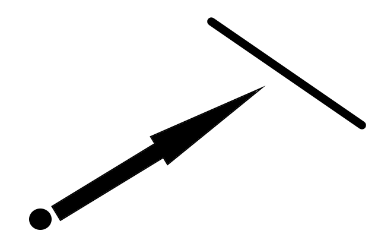
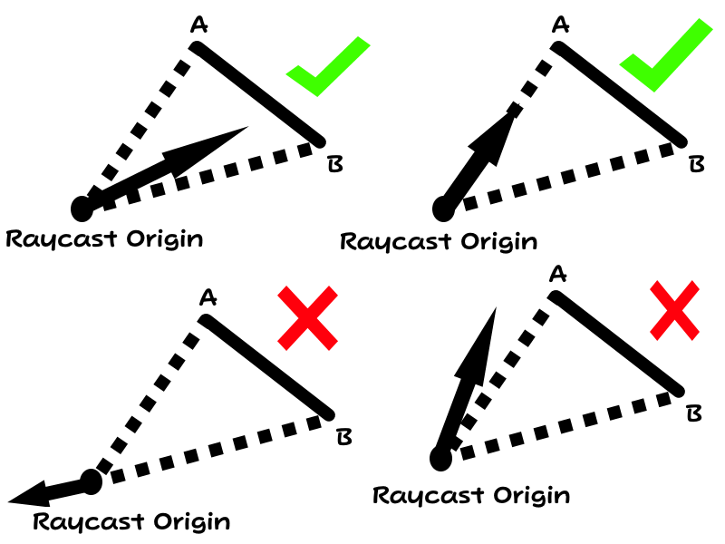
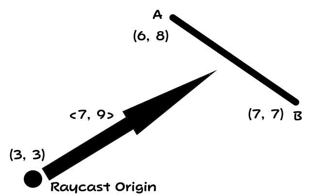
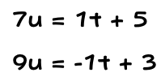
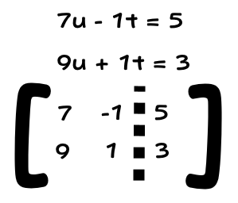
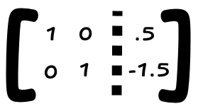

# Raycast & Line
Before a raycast can be used to retrieve the distance to a shape, we must first start with a simpler scenario to detect whether or not a raycast intersects a line.

Here is an example with what we are dealing with:

# The Algorithm
This one is a bit more tricky then just the point. First, we need to get the two vertices of the line, of which I'll call A and B. The order of these doesn't matter.

The next thing that needs to be done, similarly to the point algorithm, is to get the vectors from the raycast origin to points A and B and their slopes.
The slope of the raycast also needs to be calculated.
This allows us with an easy way to determine whether or not the raycast hits the line, as its slope must be either between A or B, or equal to the slope from the raycast origin to A or B.
Think about it. In order for the raycast to hit the line formed by A or B, its slope has to be within that range.

If the situation above is accounted for, the algorithm continues. Otherwise, null is returned as there is no intersection.

Note the bottom left scenario in the picture above. A vector in the opposite direction will still produce the same slope, so this must be accounted for, which is easiest done at the end of the algorithm.

Like the point algorithm, if the slope of the raycast equals the slope from the raycast origin to point A, return that vector as long as the signs of the X and Y components match. The same can be said for B.

Now, where the raycast vector intersects the line must be determined. Create a vector representing the line by subtracting A from B.
Then create a matrix with column 1 being the raycast direction vector, column 2 being (-1 * (B - A)), and column 3 being (A - RaycastOrigin). Row reduce to row echelon form, and take the weight for x1.
If this weight is negative, return null as it implies that a negative amount of the raycast vector is used, which means its travelling in the wrong direction.
Otherwise, just return the weight times the raycast direction vector to get the raycast value.

# Example
Here is an example of the algorithm in use:

The algorithm can be hard to grasp without doing the math, so let's walk through it.

First, let's get the slopes of A and B from the raycast origin. `Slope A: ((8 - 3) / (6 - 3)) = 1.667; Slope B: ((7 - 3) / (7 - 3)) = 1`
The slope of the raycast is `9 / 7 = 1.286`. Since it is at or between the two slopes, the algorithm can continue.

If the slope of the raycast equaled the slope of A, the vector from the raycast origin to A would be returned if both the X components match sign, and the Y components too. This is not the cast. The same can be said for B.

Now it is time to come up with a system of vector equations relative to the raycast origin, and solve where they intersect. The raycast can be modelled by the equation `<7, 9>u`, where u is some weight.
The vector for the line can be modelled by B - A, which is `<7 - 6, 7 - 8> = <1, -1>`. However, the vector equation for the line does not start at the raycast origin, and an offset needs to be applied.
This offset can be found by simply using A - RaycastOrigin as an offset. `(8 - 3, 6 - 3) = (5, 3)` Therefore, the equation for the line relative to the raycast origin is `<1, -1>t + <5, 3>` where t is some weight.

When a two vectors intersect, all the components are the same. A system of equations can then be set up such as below:

Now we need to solve this system of equations. Luckily, linear algebra is great at solving systems of equations for vectors like this. In order to do this, the equation has to be rearranged and set up to be put in a matrix:

This matrix will solve for the weights needed to be applied to each vector to get an intersection between them relative to the raycast origin. We only need one, in which it's better to choose the weight for the raycast direction, you'll see why later.
Anyways, in order to get those weights the matrix needs to be in row reduced echelon form. It should now look like this:

We can verify that this is the correct solution by checking that `.5 * <7, 9> = -1.5 * <1, -1> + <5, 3>`, and it is of course.
Since the weight applied to the raycast direction vector is not negative, it is not travelling in the reverse direction, meaning null should not be returned.
Now just return the the weight times the raycast direction to get the true raycast value: `.5 * <7, 9>`.

[Code Implementation](https://github.com/Gota7/Dreamscape/blob/master/Collision/KclHelper.cs) - My implementation for raycast algorithms can be found here.