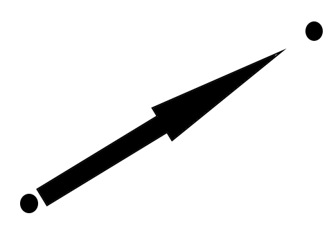
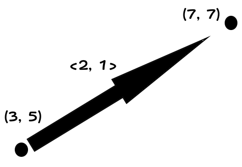

# Raycast & Point
The absolute simplest raycast is to a point.

Here is an example with what we are dealing with:

# The Algorithm
This one is pretty straightforward, just subtract from the position vector of the point the vector for the origin of the raycast.

Then get the slope of that resulting vector (Y / X component) and compare it to the slope of the raycast. If the raycast's slope matches, then that point is within the `Span { raycast }`, and that vector that represents it is that vector calculated earlier.

If the slopes do not match, then the raycast does not hit that point.

Note, there is a catch here. A raycast vector moving in the complete opposite direction still includes the point in its span. To prevent this, an additional check must be made to see if the signs of the X and Y components of the raycast vector and the calculated vector match.

# Example
Here is an example of the algorithm in use:

In the picture above, the raycast starts from `(3, 5)`, has a direction vector of `<2, 1>`, and is testing to see how long that vector is to hit the point `(7, 7)`.

First we get the vector from the origin to the point: `(7, 7) - (3, 5) = <4, 2>`.

The X component of that vector matches the sign of the raycast's X component, and the same for the Y. This means that the vector is not reaching the point backwards.

Now time to get the slopes. The slope of that vector found is `2 / 4 = .5`. The slope of the raycast is `1 / 2 = .5`.

Hurray, the slopes match. That point does indeed lie within the span of the raycast. Now we don't even need to calculate the vector from the raycast origin to the point, as we calculated that earlier (`<4, 2>`)!

[Code Implementation](https://github.com/Gota7/Dreamscape/blob/master/Collision/KclHelper.cs) - My implementation for raycast algorithms can be found here.